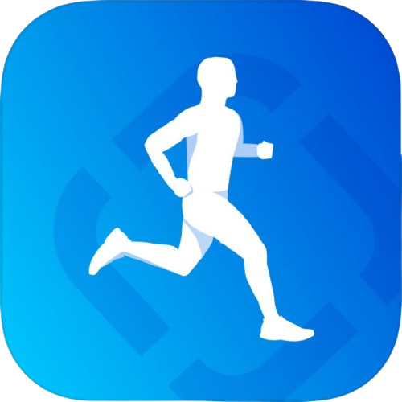
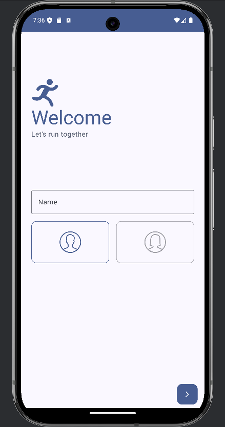
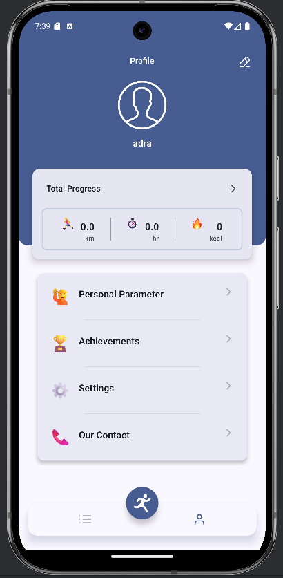
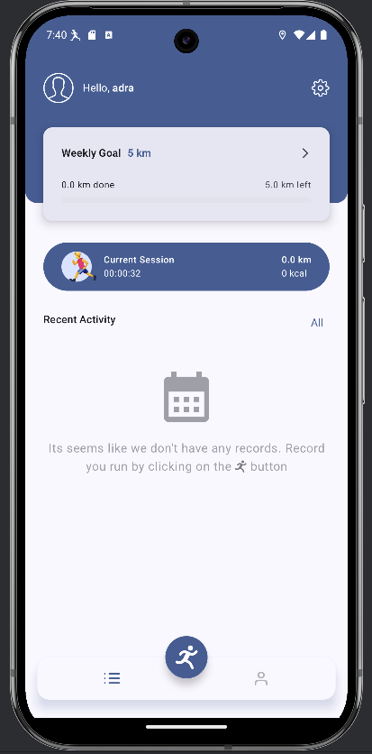
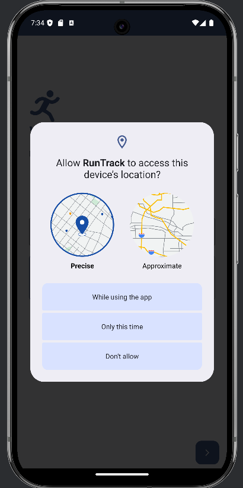

# RunningTrackerApp - Advanced Fitness Activity Tracker


RunningTrackerApp is a sophisticated Android fitness tracking application built with modern technologies including Jetpack Compose, MVVM architecture, and Google Maps integration. The app enables users to monitor their running activities in real-time, visualize routes on interactive maps, and maintain comprehensive activity statistics using Room database persistence.


## Key Features

- **Real-time GPS Tracking**: Monitor your running activities with precise GPS tracking
- **Interactive Route Visualization**: View your running path in real-time using the Google Maps Compose library
- **Background Tracking**: Continuous activity monitoring via Foreground Service, even when the app is closed or removed from the background
- **Comprehensive Data Storage**: Persistent storage of running statistics with Room database
- **Advanced Navigation**: Seamless nested navigation, deep linking, and conditional navigation to onboarding screens via Jetpack Navigation Component
- **Permission-free Image Selection**: Integrated Jetpack Compose image picker for hassle-free image selection without additional permissions
- **Efficient Data Loading**: Integrated Paging3 for smooth, efficient data presentation
- **Adaptive Theming**: Dynamic color support in both dark and light themes
- **Statistical Analysis**: Weekly activity statistics with customizable graph filters

## Screenshots

<div style="display: flex; gap: 20px;">
  
  
  
  
</div>

## Architecture & Package Structure

RunningTrackerApp follows the MVVM architecture with Unidirectional Data Flow (UDF) and clean architecture principles. The project is organized into the following key packages:

* **`background`**: Manages background processes including services
* **`data`**: Responsible for data production and management
    * **`tracking`**: Handles location tracking and activity monitoring
* **`di`**: Contains Hilt dependency injection modules
* **`domain`**: Houses common use cases and interfaces
* **`ui`**: Manages the application's user interface
    * **`nav`**: App navigation and destination management
    * **`screen`**: UI implementation components
    * **`theme`**: Material 3 theming components
    * **`common`**: UI utilities and shared components
* **`common`**: Cross-application utility classes


## Technology Stack

- **[Kotlin](https://kotlinlang.org/)**: Modern, concise programming language
- **[Jetpack Compose](https://developer.android.com/jetpack/compose)**: Declarative UI framework
- **[Jetpack Navigation](https://developer.android.com/jetpack/compose/navigation)**: Screen navigation and deep linking
- **[Room](https://developer.android.com/jetpack/androidx/releases/room)**: SQLite database abstraction layer
- **[Google Maps API](https://developers.google.com/maps/documentation/android-sdk)**: Location tracking and map visualization
- **[Hilt](https://developer.android.com/training/dependency-injection/hilt-android)**: Dependency injection framework
- **[Preferences DataStore](https://developer.android.com/topic/libraries/architecture/datastore)**: Data persistence for user settings
- **[Coil](https://coil-kt.github.io/coil/compose/)**: Asynchronous image loading
- **[Vico](https://patrykandpatrick.com/vico/)**: Statistical chart visualization

## Getting Started

### Basic Setup
1. Clone the repository
2. Open the project in Android Studio

<!-- ### Google Maps Integration (Optional)
The core tracking functionality works without Maps integration, but for the full experience:

1. Obtain a Google Maps API key following the official [guide](https://developers.google.com/maps/documentation/android-sdk/get-api-key)
2. Open the `local.properties` file
3. Add your API key:
   ```
   MAPS_API_KEY=your_maps_api_key
   ``` -->

## Future Development

Planned enhancements include:

1. Complete profile management implementation
2. Comprehensive unit test coverage
3. Optimized image storage (moving from direct database storage to file system with references)
4. Enhanced map markers for start, end, and current positions